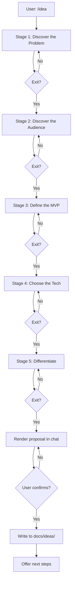

# /idea — Software Project Brainstorming Skill

A Claude Code / Anthropic-agents skill that helps you figure out what software project to build. You run `/idea`, the AI asks you 8-12 questions across 5 stages, and at the end you get a 5-section project proposal saved to `docs/ideas/`.

## Installation

### Claude Code

This project's root directory IS the skill folder. Copy the whole project (or clone the repo) into one of these locations, renamed to `idea`:

- Project-local: `.claude/skills/idea/` inside the project where you'll use `/idea`
- User-global: `~/.claude/skills/idea/`

```bash
# from the project where you want to use /idea
mkdir -p .claude/skills
cp -r /path/to/IdeasSkill .claude/skills/idea
```

### Cursor / Trae / Codex

These agents use the same Anthropic SKILL.md format. Copy the project (renamed to `idea`) to wherever the agent looks for skills — typically `.cursor/skills/idea/`, `~/.trae-cn/skills/idea/`, or `~/.codex/skills/idea/`.

## Usage

Invoke the skill with the slash command:

```
/idea
```

Or describe your situation in natural language — the skill triggers on phrases like:
- "I want to start a project"
- "help me brainstorm"
- "I need project ideas"
- "what should I build"
- "想做个项目"
- "帮我想个点子"

## The 5-stage flow



## Output

A markdown file at `docs/ideas/YYYY-MM-DD-<slug>-idea.md` with 5 sections:

1. One-liner (≤20 words)
2. Problem
3. Target User & Scenario
4. MVP Features (3-5 bullets)
5. Why You, Why Now

See `examples/cli-time-tracker.md` and `examples/api-mock-server.md` for worked examples.

## File layout

```
.                                       # project root = skill folder
├── SKILL.md                            # main entry
├── references/                         # 5 stage probe trees
├── templates/                          # proposal template
├── examples/                           # 2 worked examples
├── LICENSE
└── README.md
```

## Contributing

To add a new stage or modify a probe tree:

1. Create or edit the relevant `references/<stage>.md` file. Follow the convention: `## Goal`, `## Opening Question`, `## Probe Tree` (with IF-THEN rules), `## Exit Criteria`, `## Anti-patterns`.
2. Update `SKILL.md` if you add a new stage to the 5-stage table.
3. Update `README.md` if you change the flow.

To add a new example:

1. Create `examples/<project-slug>.md` containing the full final proposal (5 sections).
2. Append a 100-200 word "Conversation recap" at the end showing the key turns.

## License

MIT. See `LICENSE`.
