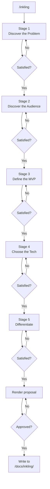

# /inkling — From "no idea" to "ship it"

[中文](README.zh.md)

**inkling** is a skill for AI coding agents that turns a vague desire to build something into a concrete, defensible project proposal. It walks you through 5 structured stages — about 10 questions, 10 minutes — and saves the result to disk.

Works with Claude Code, Cursor, Codex, Windsurf, Gemini CLI, OpenCode, and any agent that supports the Anthropic SKILL.md format.

## Quick start

```bash
# Install globally — one command
npx skills add https://github.com/Eververdants/inkling
```

Then in any project:

```
/inkling
```

The AI asks ~10 questions across 5 stages. At the end, you get a proposal at `<your-project>/docs/inkling/`.

## Installation

### Plugin marketplace (Claude Code CLI)

```bash
/plugin marketplace add Eververdants/inkling
/plugin install inkling@inkling
```

### npx skills

Works across 40+ coding agents. Auto-detects your agent and places the skill in the right directory — no path hunting.

```bash
# SSH
npx skills add git@github.com:Eververdants/inkling.git

# HTTPS
npx skills add https://github.com/Eververdants/inkling
```

### Manual setup

#### Claude Code

The skill content lives in the `skill/` subdirectory of this repo. Copy it in:

```bash
git clone https://github.com/Eververdants/inkling.git /tmp/inkling
cp -r /tmp/inkling/skill ~/.claude/skills/inkling
rm -rf /tmp/inkling
```

Or clone the whole repo (the SKILL.md will be at `skill/SKILL.md` inside the clone):

```bash
git clone https://github.com/Eververdants/inkling.git ~/.claude/skills/inkling
```

#### Cursor / Windsurf / Codex / Gemini CLI

Copy the `skill/` folder to your agent's skills path:

| Agent     | Path                     |
|-----------|--------------------------|
| Cursor    | `~/.cursor/skills/inkling/`   |
| Windsurf  | `~/.windsurf/skills/inkling/` |
| Codex     | `~/.codex/skills/inkling/`    |
| Gemini CLI| `~/.gemini/skills/inkling/`   |

#### OpenCode

Clone the full repo into the OpenCode skills directory. OpenCode auto-discovers all SKILL.md files at any depth, so the nested `skill/` folder is not a problem:

```bash
git clone https://github.com/Eververdants/inkling.git ~/.opencode/skills/inkling
```

The file structure will be `~/.opencode/skills/inkling/skill/SKILL.md` — no config changes needed. Skills become available after restarting OpenCode.

## What you get

A 6-section markdown proposal — concrete enough to start building from:

```
<your-project>/docs/inkling/2026-06-24-<slug>-idea.md
```

| # | Section | What it covers |
|---|---------|----------------|
| 1 | **One-liner** | The idea in ≤20 words |
| 2 | **Problem** | Who suffers, how much, and why it hurts |
| 3 | **Target User & Scenario** | One specific persona, one vivid moment |
| 4 | **MVP Features** | 3–5 sharp, shippable actions |
| 5 | **Why You, Why Now** | Competitive gap and founder fit |
| 6 | **Risks & Mitigations** | Honest look at what could go wrong |

See [`examples/api-mock-server.md`](skill/examples/api-mock-server.md) and [`examples/cli-time-tracker.md`](skill/examples/cli-time-tracker.md) for worked examples.

## How it works

The conversation follows 5 stages. Each stage has a clear goal and exit criterion. You set the pace — advance, dig deeper, or go back.



### Stage 1 — Discover the Problem

Extract a concrete, emotionally-weighted problem statement. Not "productivity" — but "I wasted 3 hours manually reconciling invoices every Friday."

### Stage 2 — Discover the Audience

Name one specific person who has this problem. Give them a name, a scene, a channel where you can reach them.

### Stage 3 — Define the MVP

Draw a hard line between v1 must-haves and v2 nice-to-haves. No more than 5 features, each describing a user action, not a technology.

### Stage 4 — Choose the Tech

Pick a stack you can actually ship with. Bias toward tools you already know unless there's a strong reason to learn something new.

### Stage 5 — Differentiate

Name real competitors, identify the gap they leave open, and articulate why you're the right person to fill it.

## Why inkling?

Building the wrong thing is the most expensive mistake a project can make. **inkling** forces you to answer the hard questions *before* you write a line of code:

- **Speed** — ~10 questions, ~10 minutes, a complete proposal
- **Depth** — you don't just name a problem, you quantify its emotional weight
- **Honesty** — every stage has exit criteria that prevent hand-waving
- **Ownership** — the AI asks, but *you* answer. The idea stays yours.

## Project structure

```
.
├── skill/                      # ← The actual skill (clean, AI-only)
│   ├── SKILL.md                #   Skill definition (the AI reads this)
│   ├── references/             #   5 stage probe trees
│   │   ├── discover-problem.md
│   │   ├── discover-audience.md
│   │   ├── define-mvp.md
│   │   ├── choose-tech.md
│   │   └── differentiate.md
│   ├── templates/
│   │   └── proposal-template.md
│   ├── examples/
│   │   ├── api-mock-server.md
│   │   └── cli-time-tracker.md
│   └── docs/
│       └── README.md           #   Output directory layout
├── README.md                   # ← you are here (English)
├── README.zh.md                #   中文文档
├── LICENSE
└── .gitignore
```

## Contributing

**Add a new stage:** Create `references/<stage>.md` following the existing convention (`## Goal`, `## Probe Tree`, `## Exit Criteria`), then update the stage table in `SKILL.md`.

**Add an example:** Create `examples/<project-slug>.md` with the full 6-section proposal plus a 100–200 word conversation recap.

**Fix or improve probe trees:** Edit the relevant file in `references/`. Each probe tree documents which branches handle which user responses.

## License

MIT. See [LICENSE](LICENSE).
