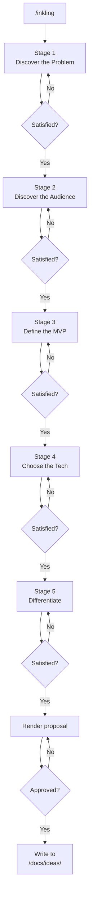

# /inkling — From "I have no idea" to "ship it"

[中文](README.zh.md)

**inkling** is an AI-powered brainstorming companion that walks you through 5 structured stages to turn a vague itch into a concrete, defensible software project. In about 10 minutes, you'll have a polished proposal saved to disk.

Works with Claude Code, Cursor, Codex, Windsurf, Gemini CLI, and any agent that supports the Anthropic SKILL.md format.

## Quick start

```bash
# Install globally — one command, done
npx skills add eververdants/inkling/tree/main/skill -g -y
```

Then in any project:

```
/inkling
```

The AI asks ~10 questions across 5 stages. At the end, you get a proposal at `<your-project>/docs/ideas/`.

## Installation

### npx skills add (recommended)

Works across 40+ coding agents. The tool auto-detects your agent and places the skill in the right directory.

```bash
# Global (available in every project)
npx skills add eververdants/inkling/tree/main/skill -g -y

# Current project only
npx skills add eververdants/inkling/tree/main/skill -y

# Specific agent
npx skills add eververdants/inkling/tree/main/skill -a cursor -g -y

# All agents at once
npx skills add eververdants/inkling/tree/main/skill --all -y
```

### Manual copy

The actual skill content lives in the `skill/` subdirectory of this repo. Copy only that folder:

```bash
git clone https://github.com/Eververdants/inkling.git /tmp/inkling
cp -r /tmp/inkling/skill ~/.claude/skills/inkling
rm -rf /tmp/inkling
```

Or clone the whole repo, then symlink just the `skill/` folder:

```bash
git clone https://github.com/Eververdants/inkling.git ~/.claude/skills/inkling
# The skill loader reads skill/SKILL.md inside the folder
```

| Agent | Path |
|-------|------|
| Claude Code | `~/.claude/skills/inkling/` |
| Cursor | `~/.cursor/skills/inkling/` |
| Windsurf | `~/.windsurf/skills/inkling/` |
| Codex | `~/.codex/skills/inkling/` |
| Trae (CN) | `~/.trae-cn/skills/inkling/` |
| Gemini CLI | `~/.gemini/skills/inkling/` |

## What you get

A 5-section markdown proposal — concrete enough to start building from:

```
<your-project>/docs/ideas/2026-06-23-<slug>-idea.md
```

1. **One-liner** — the idea in ≤20 words
2. **Problem** — who suffers, how much, and why it hurts
3. **Target User & Scenario** — one persona, one vivid moment
4. **MVP Features** — 3–5 sharp, shippable actions
5. **Why You, Why Now** — competitive gap, founder fit, honest risks

See [`examples/api-mock-server.md`](skill/examples/api-mock-server.md) and [`examples/cli-time-tracker.md`](skill/examples/cli-time-tracker.md) for worked examples.

## How it works

The conversation follows 5 stages. Each stage has a clear goal and exit criterion. You always control the pace — advance, dig deeper, or go back.



### Stage 1 — Discover the Problem
Extract a concrete, emotionally-weighted problem statement. Not "productivity" — but "I wasted 3 hours manually reconciling invoices every Friday."

### Stage 2 — Discover the Audience
Name one specific person who has this problem. Give them a name, a scene, a channel where you can reach them.

### Stage 3 — Define the MVP
Draw a hard line between v1 must-haves and v2 nice-to-haves. No more than 5 features, each describing a user action, not a technology.

### Stage 4 — Choose the Tech
Pick a stack you can actually ship with. Bias toward tools you already know unless there's a strong reason to learn something new.

### Stage 5 — Differentiate
Name real competitors, identify the gap they leave open, and articulate why you're the right person to fill it.

## Why inkling?

Building the wrong thing is the most expensive mistake a project can make. **inkling** forces you to answer the hard questions *before* you write a line of code:

- **Speed** — ~10 questions, ~10 minutes, a complete proposal
- **Depth** — you don't just name a problem, you quantify its emotional weight
- **Honesty** — every stage has exit criteria that prevent hand-waving
- **Ownership** — the AI asks, but *you* answer. The idea stays yours.

## Project structure

```
.
├── skill/                      # ← The actual skill (clean, AI-only)
│   ├── SKILL.md                #   Skill definition (the AI reads this)
│   ├── references/             #   5 stage probe trees
│   │   ├── discover-problem.md
│   │   ├── discover-audience.md
│   │   ├── define-mvp.md
│   │   ├── choose-tech.md
│   │   └── differentiate.md
│   ├── templates/
│   │   └── proposal-template.md
│   ├── examples/
│   │   ├── api-mock-server.md
│   │   └── cli-time-tracker.md
│   └── docs/
│       └── README.md           #   Output directory layout
├── README.md                   # ← you are here (human docs)
├── README.zh.md                # 中文文档
├── LICENSE
└── .gitignore
```

## Contributing

**Add a new stage:** Create `references/<stage>.md` following the existing convention (`## Goal`, `## Probe Tree`, `## Exit Criteria`), then update the stage table in `SKILL.md`.

**Add an example:** Create `examples/<project-slug>.md` with the full 5-section proposal plus a 100–200 word conversation recap.

**Fix or improve probe trees:** Edit the relevant file in `references/`. Each probe tree documents which branches handle which user responses.

## License

MIT. See [LICENSE](LICENSE).
