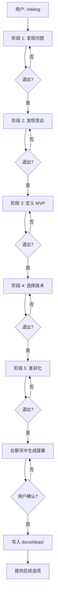

# /inkling — 软件项目头脑风暴技能

[English](README.md) | [中文](README.zh.md)

一个 Claude Code / Anthropic agents 技能，帮助你找出值得做的软件项目。运行 `/inkling`，AI 在 5 个阶段里向你提 8-12 个问题（多数问题用 `AskUserQuestion` 让你直接点选），最后得到一份 5 板块的项目提案，保存在 `docs/ideas/` 目录下。

## 安装

### Claude Code

本项目的根目录本身就是技能文件夹。把整个项目（或 clone 下来的仓库）复制到下面任一位置，并重命名为 `inkling`：

- 项目内：`.claude/skills/inkling/`，放在你会使用 `/inkling` 的项目里
- 全局：`~/.claude/skills/inkling/`

```bash
# 在你想使用 /inkling 的项目根目录下执行
mkdir -p .claude/skills
cp -r /path/to/IdeasSkill .claude/skills/inkling
```

### Cursor / Trae / Codex

这些 agent 使用相同的 Anthropic SKILL.md 格式。把项目（重命名为 `inkling`）复制到对应 agent 寻找技能的位置 —— 通常是 `.cursor/skills/inkling/`、`~/.trae-cn/skills/inkling/`，或 `~/.codex/skills/inkling/`。

## 用法

通过斜杠命令调用技能：

```
/inkling
```

或者用自然语言描述你的情况 —— 技能在以下说法时触发：

- "I want to start a project"
- "help me brainstorm"
- "I need project ideas"
- "what should I build"
- "想做个项目"
- "帮我想个点子"

## 5 阶段流程



## 输出

一个 markdown 文件，路径是 `docs/ideas/YYYY-MM-DD-<slug>-idea.md`，包含 5 个板块：

1. 一句话描述（≤20 词）
2. 问题陈述
3. 目标用户与场景
4. MVP 核心功能（3-5 个 bullet）
5. 凭什么是你，为什么是现在

参考 `examples/cli-time-tracker.md` 和 `examples/api-mock-server.md` 查看完整示例。

## 文件布局

```
.                                       # 项目根 = 技能文件夹
├── SKILL.md                            # 主入口
├── references/                         # 5 个阶段的提问树
├── templates/                          # 提案模板
├── examples/                           # 2 个完整示例
├── LICENSE
├── README.md                           # 英文文档
└── README.zh.md                        # 中文文档
```

## 贡献

要新增阶段或修改提问树：

1. 创建或编辑对应的 `references/<stage>.md` 文件。按约定格式：`## Goal`、`## Opening Question`、`## Question Format`（AskUserQuestion 模板）、`## Probe Tree`（带 IF-THEN 规则）、`## Exit Criteria`、`## Anti-patterns`。
2. 如果新增了 5 阶段表格中的阶段，更新 `SKILL.md`。
3. 如果改了流程，同步更新 `README.md` 与 `README.zh.md`。

要新增示例：

1. 在 `examples/<project-slug>.md` 下创建包含完整最终提案（5 板块）的文件。
2. 在末尾追加一段 100-200 字的"对话复盘"，展示关键节点。

## 许可证

MIT。详见 `LICENSE`。
