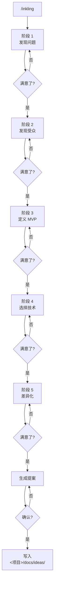

# /inkling — 从 "没想好" 到 "开干"

[English](README.md)

**inkling** 是一个 AI 驱动的头脑风暴技能。你没想好做什么项目时，它会用 5 个阶段、约 10 个问题，帮你把一个模糊的念头，变成一份可以照着开干的完整提案。

支持 Claude Code、Cursor、Codex、Windsurf、Gemini CLI 等所有兼容 Anthropic SKILL.md 格式的 agent。

## 快速上手

```bash
# 全局安装 — 一条命令搞定
npx skills add eververdants/inkling/tree/main/skill -g -y
```

然后在任意项目里：

```
/inkling
```

AI 会问你约 10 个问题，贯穿 5 个阶段。结束之后，提案文件会保存在你的项目目录下 `<你的项目>/docs/ideas/`。

## 安装方式

### npx skills add（推荐）

支持 40+ 种 agent，自动检测你用的工具并安装到正确位置。

```bash
# 全局安装（所有项目可用）
npx skills add eververdants/inkling/tree/main/skill -g -y

# 只装在当前项目
npx skills add eververdants/inkling/tree/main/skill -y

# 指定 agent
npx skills add eververdants/inkling/tree/main/skill -a cursor -g -y

# 同时装到所有支持的 agent
npx skills add eververdants/inkling/tree/main/skill --all -y
```

### 手动复制

技能内容在仓库的 `skill/` 子目录中。只复制这个文件夹：

```bash
git clone https://github.com/Eververdants/inkling.git /tmp/inkling
cp -r /tmp/inkling/skill ~/.claude/skills/inkling
rm -rf /tmp/inkling
```

| Agent | 路径 |
|-------|------|
| Claude Code | `~/.claude/skills/inkling/` |
| Cursor | `~/.cursor/skills/inkling/` |
| Windsurf | `~/.windsurf/skills/inkling/` |
| Codex | `~/.codex/skills/inkling/` |
| Trae (CN) | `~/.trae-cn/skills/inkling/` |
| Gemini CLI | `~/.gemini/skills/inkling/` |

## 你会得到什么

一份 5 板块的 markdown 提案，成熟到可以直接开工：

```
<你的项目>/docs/ideas/2026-06-23-<slug>-idea.md
```

| # | 板块 | 内容 |
|---|------|------|
| 1 | **一句话概括** | ≤20 字讲清做什么、为谁做 |
| 2 | **问题陈述** | 谁在痛、多痛、为什么是现在 |
| 3 | **目标用户与场景** | 一个具体的人，一个生动的使用瞬间 |
| 4 | **MVP 核心功能** | 3–5 个可交付的用户操作 |
| 5 | **凭什么是你** | 竞争格局、你的独特优势、真实风险 |

参考 [`examples/api-mock-server.md`](skill/examples/api-mock-server.md) 和 [`examples/cli-time-tracker.md`](skill/examples/cli-time-tracker.md) 查看完整示例。

## 5 阶段流程

每次对话分为 5 个阶段，每个阶段有明确目标。你掌握节奏 —— 可以前进、深入追问，也可以回退修改。



### 阶段 1 — 发现问题
把模糊的念头变成一句具体的问题陈述。不是"效率太低"，而是"每周五花 3 小时手工对账，烦死了"。

### 阶段 2 — 发现受众
找出一个真实存在、有这个问题的具体人群。给他们一个名字、一个场景、一个能找到他们的渠道。

### 阶段 3 — 定义 MVP
在"v1 必须做"和"v2 再说"之间划一条硬线。不超过 5 个功能，每个都是用户可以感知的操作，不是技术名词。

### 阶段 4 — 选择技术
选一个你真正能交付的技术栈。倾向你已掌握的，除非有充分理由学新的。

### 阶段 5 — 差异化
承认赛道上有竞争者，找到他们留出的缝隙，说清楚为什么你是填上它的人。

## 为什么要用 inkling？

做错方向是项目最大的浪费。inkling 让你在写代码之前，先把关键问题想透：

- **速度快** — ～10 个问题，～10 分钟，一份完整提案
- **挖得深** — 不只是问"你要做什么"，而是量化痛点、锁定受众
- **不糊弄** — 每个阶段有明确的退出条件，防止含混过关
- **你主导** — AI 提问，你回答。主意是你的，决策权也是你的

## 项目结构

```
.
├── skill/                      # ← 实际技能内容（干净，仅 AI 所需）
│   ├── SKILL.md                #   技能定义（AI 读这个文件）
│   ├── references/             #   5 个阶段的提问树
│   │   ├── discover-problem.md
│   │   ├── discover-audience.md
│   │   ├── define-mvp.md
│   │   ├── choose-tech.md
│   │   └── differentiate.md
│   ├── templates/
│   │   └── proposal-template.md
│   ├── examples/
│   │   ├── api-mock-server.md
│   │   └── cli-time-tracker.md
│   └── docs/
│       └── README.md           #   输出目录说明
├── README.md                   # 英文文档
├── README.zh.md                # ← 你在这里
├── LICENSE
└── .gitignore
```

## 贡献指南

**新增阶段：** 按现有惯例创建 `references/<stage>.md`（包含 `## Goal`、`## Probe Tree`、`## Exit Criteria`），然后在 `SKILL.md` 的阶段表中更新。

**新增示例：** 创建 `examples/<project-slug>.md`，包含完整的 5 板块提案，末尾附加 100–200 字的对话复盘。

**改进提问树：** 编辑 `references/` 下的对应文件。每个提问树都标注了针对不同用户回答的处理分支。

## 许可证

MIT。详见 [LICENSE](LICENSE)。
