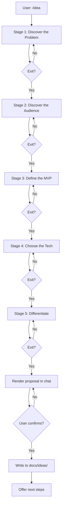

# /idea Skill Implementation Plan

> **For agentic workers:** REQUIRED SUB-SKILL: Use superpowers:subagent-driven-development (recommended) or superpowers:executing-plans to implement this plan task-by-task. Steps use checkbox (`- [ ]`) syntax for tracking.

**Goal:** Build the `/idea` skill package — a static collection of markdown files that lets Claude Code / Anthropic agents drive a 5-stage recursive brainstorming conversation and save a 5-section project proposal.

**Architecture:** Progressive disclosure. `SKILL.md` is the entry index carrying triggers, hard rules, and the 5-stage flow. Five `references/*.md` files hold the per-stage probe trees. A `templates/proposal-template.md` defines the output shape. Two `examples/*.md` are worked transcripts. `README.md` documents installation and usage. `LICENSE` is MIT.

**Tech Stack:** Markdown only. No build step, no runtime, no dependencies. The "tests" are spec-coverage self-review checklists at the end of each file-creation task.

---

## File Structure

The project root IS the skill folder. All files live at the project root, not in a subdirectory.

```
.                                          # project root = skill folder
├── LICENSE                                 # MIT license
├── README.md                               # user-facing docs (install, usage, flow)
├── SKILL.md                                # main entry: triggers, hard rules, flow
├── references/
│   ├── discover-problem.md                 # stage 1 probe tree
│   ├── discover-audience.md                # stage 2 probe tree
│   ├── define-mvp.md                       # stage 3 probe tree
│   ├── choose-tech.md                      # stage 4 probe tree
│   └── differentiate.md                    # stage 5 probe tree
├── templates/
│   └── proposal-template.md                # 5-section proposal template
└── examples/
    ├── cli-time-tracker.md                 # worked example 1 (CLI tool)
    └── api-mock-server.md                  # worked example 2 (API service)
```

**Decomposition rules applied:**
- Each reference file = one stage, one clear purpose, can be edited independently.
- Template file separate from SKILL.md so future redesigns of the proposal shape don't touch the main entry.
- Examples are separate so adding new examples doesn't bloat the main files.
- README is separate from SKILL.md because it's for humans installing, not for the agent reading.

---

## Task 1: Create MIT LICENSE

**Files:**
- Create: `LICENSE`

- [ ] **Step 1: Write the file**

Write the following content to `LICENSE`:

```
MIT License

Copyright (c) 2026

Permission is hereby granted, free of charge, to any person obtaining a copy
of this software and associated documentation files (the "Software"), to deal
in the Software without restriction, including without limitation the rights
to use, copy, modify, merge, publish, distribute, sublicense, and/or sell
copies of the Software, and to permit persons to whom the Software is
furnished to do so, subject to the following conditions:

The above copyright notice and this permission notice shall be included in all
copies or substantial portions of the Software.

THE SOFTWARE IS PROVIDED "AS IS", WITHOUT WARRANTY OF ANY KIND, EXPRESS OR
IMPLIED, INCLUDING BUT NOT LIMITED TO THE WARRANTIES OF MERCHANTABILITY,
FITNESS FOR A PARTICULAR PURPOSE AND NONINFRINGEMENT. IN NO EVENT SHALL THE
AUTHORS OR COPYRIGHT HOLDERS BE LIABLE FOR ANY CLAIM, DAMAGES OR OTHER
LIABILITY, WHETHER IN AN ACTION OF CONTRACT, TORT OR OTHERWISE, ARISING FROM,
OUT OF OR IN CONNECTION WITH THE SOFTWARE OR THE USE OR OTHER DEALINGS IN THE
SOFTWARE.
```

- [ ] **Step 2: Verify the file exists**

Run: `ls LICENSE`
Expected: line containing `LICENSE`

- [ ] **Step 3: Commit**

```bash
git add LICENSE
git commit -m "docs: add MIT LICENSE"
```

---

## Task 2: Create proposal template

**Files:**
- Create: `templates/proposal-template.md`

- [ ] **Step 1: Create the templates directory and write the file**

Write the following content to `templates/proposal-template.md`:

````markdown
# <Project Name>

> Use this template after the 5-stage conversation completes. The AI fills in each section from the conversation log; the user reviews before write-to-disk.

## 1. One-liner

<≤20 words: what + for whom>

## 2. Problem

<2-3 paragraphs: scenario + prevalence/severity + why now>

## 3. Target User & Scenario

<1 persona paragraph + 1 concrete usage story (time, place, action)>

## 4. MVP Features

<3-5 bullets: action + user-perceivable value>

- **<Feature name>** — <one sentence: what it does + value the user feels>

## 5. Why You, Why Now

<2-3 paragraphs: competitor landscape + differentiator + founder fit>

---

*Generated by /idea on <YYYY-MM-DD>*
*Conversation log: <3-line summary of the 5 stages>*
````

- [ ] **Step 2: Self-review against spec section 7**

Open the spec at `docs/superpowers/specs/2026-06-23-idea-skill-design.md` section 7. Verify the template contains exactly the 5 sections (One-liner, Problem, Target User & Scenario, MVP Features, Why You Why Now) plus the footer. Fix any deviation.

- [ ] **Step 3: Commit**

```bash
git add templates/proposal-template.md
git commit -m "feat(template): add 5-section proposal template"
```

---

## Task 3: Create Stage 1 reference — discover-problem

**Files:**
- Create: `references/discover-problem.md`

- [ ] **Step 1: Write the file**

Write the following content to `references/discover-problem.md`:

````markdown
# Stage 1: Discover the Problem

## Goal

Extract a concrete, emotionally-weighted problem statement. The user must be able to name a specific group that suffers from it (not "everyone") and articulate why it hurts.

## Opening Question

"What problem are you trying to solve, or what frustrates you in your work or life right now?"

## Probe Tree

- **IF user gives a vague answer** ("I don't know", "everything is broken", "I just want to build something")
  - Probe: "Forget building for a moment. Pick one moment from the past week when you felt annoyed or blocked doing something — what was it? Walk me through it."
  - Follow-up if still vague: "If you had a magic wand and could automate exactly one thing you do repeatedly, what would it be?"

- **IF user names a problem area** ("communication", "productivity", "managing tasks")
  - Probe: "Specifically, which moment inside that area is most painful? Give me a concrete scene — when, where, who else was there, what happened."
  - Follow-up: "How often does that scene happen — daily, weekly, monthly?"

- **IF user names a personal pain** ("my code reviews take forever", "I keep losing track of which client owes what")
  - Probe: "How much time or money does this cost you per week? Who else has the same problem that you know of?"
  - Follow-up: "Have you tried any tools or hacks for this? Why didn't they stick?"

- **IF user says "I want to make money" or pivots to solution** ("I want to build an AI assistant for X")
  - Probe: "Forget the solution and money for a moment. What would you build just for fun or curiosity, even if nobody paid?"
  - Follow-up: "Why does that one pull at you? What itch does it scratch?"

## Exit Criteria

Move to stage 2 only when ALL of these are true:

- [ ] User can state the problem in one clear sentence
- [ ] The sentence names a specific group (e.g. "freelance designers", not "everyone")
- [ ] User shows emotional weight ("I hate this", "this wasted 3 hours of my day", "it's embarrassing when…")
- [ ] User has given at least one concrete scene (time + place + action), not just an abstract description

If any criterion is unmet, ask one more focused probe. Do not advance.

## Anti-patterns

**User mistakes to watch for:**
- Describing a solution, not a problem ("I want to build an AI chatbot"). Refocus: "What's the human problem behind wanting to build that?"
- Naming too broad an audience ("anyone who codes"). Narrow: "Pick one specific type of coder you know personally."
- Skipping the emotional layer. If the user sounds detached, ask: "How does this make you feel when it happens?"

**AI mistakes to avoid:**
- Don't suggest solutions during this stage. Stay in the problem lane.
- Don't accept "productivity" or "communication" as a problem. These are categories, not problems.
- Don't move to stage 2 just because the user wrote a paragraph. Apply the exit criteria.
````

- [ ] **Step 2: Self-review against spec section 6**

Verify the file follows the spec's reference-file convention: `# Stage N: <Name>` heading, `## Goal`, `## Opening Question`, `## Probe Tree` (with IF-THEN rules), `## Exit Criteria`, `## Anti-patterns`. Fix any missing section.

- [ ] **Step 3: Commit**

```bash
git add references/discover-problem.md
git commit -m "feat(stage-1): add problem discovery probe tree"
```

---

## Task 4: Create Stage 2 reference — discover-audience

**Files:**
- Create: `references/discover-audience.md`

- [ ] **Step 1: Write the file**

Write the following content to `references/discover-audience.md`:

````markdown
# Stage 2: Discover the Audience

## Goal

Convert the abstract problem into a concrete user persona with a specific usage scenario. The user must produce at least one named persona and one vivid scene.

## Opening Question

"Of all the people who have this problem, who has it most acutely? Tell me about one specific person you have in mind — it could even be yourself."

## Probe Tree

- **IF user names a broad group** ("developers", "small businesses", "students")
  - Probe: "Pick a single person in that group you actually know or could imagine vividly. What does their day look like? Where do they live, what tools do they use, how old are they?"
  - Follow-up: "In what moment of their day does this problem hit them hardest?"

- **IF user says "myself" or "me"**
  - Probe: "Good — tell me about a specific day last week when this problem hit you. Walk me through it hour by hour if you can."
  - Follow-up: "Are there 10+ people exactly like you who'd want this? Where do they hang out online?"

- **IF user describes multiple personas** ("designers and developers and PMs")
  - Probe: "Pick just one of those groups for the MVP. Which one would feel the most relief if this existed tomorrow?"
  - Follow-up: "We'll design for that one first. You can always expand later."

- **IF user can't name anyone** ("it's for everyone")
  - Probe: "Pretend you're marketing this. If you had to pick ONE website where the first 100 users would come from, which site? That's your initial audience."

## Exit Criteria

Move to stage 3 only when ALL of these are true:

- [ ] User names at least one specific persona (not a category)
- [ ] User describes a concrete usage scene with time + place + action
- [ ] User can name at least one reachable channel for finding these people (a subreddit, a Slack group, a Twitter hashtag, a conference, etc.)

If any criterion is unmet, ask one more focused probe. Do not advance.

## Anti-patterns

**User mistakes to watch for:**
- Conflating "user" with "buyer" (in B2B, the person who suffers ≠ the person who pays). Probe both if relevant.
- Naming themselves as the only user with no path to others. Probe: "How do you find more people like you?"

**AI mistakes to avoid:**
- Don't suggest the target audience. The user must pick.
- Don't let the user skip the scene. Without a scene, MVP features in stage 3 will be generic.
- Don't accept "developers" or "designers" alone. Require a narrower slice.
````

- [ ] **Step 2: Self-review against spec section 6**

Verify the file follows the reference-file convention. Fix any missing section.

- [ ] **Step 3: Commit**

```bash
git add references/discover-audience.md
git commit -m "feat(stage-2): add audience discovery probe tree"
```

---

## Task 5: Create Stage 3 reference — define-mvp

**Files:**
- Create: `references/define-mvp.md`

- [ ] **Step 1: Write the file**

Write the following content to `references/define-mvp.md`:

````markdown
# Stage 3: Define the MVP

## Goal

Force the user to draw a sharp line between "must have for v1" and "nice to have later." No more than 5 features, each one a single user-perceivable action.

## Opening Question

"If you could ship something in 2 weeks that made your persona say 'finally, this solves the worst part' — what would it do? List the smallest set of features that would still feel like a real solution."

## Probe Tree

- **IF user lists more than 5 features**
  - Probe: "Pick the 3 that, if you removed them, the user would say 'this is useless.' Those are the core. Drop the rest to v2."
  - Follow-up: "For each of the 3: what does the user DO with the feature, and what do they FEEL after using it?"

- **IF user lists vague features** ("AI-powered", "smart matching", "personalized")
  - Probe: "Describe the user action in 5 seconds. They click X, type Y, and see Z. What is X, Y, Z?"
  - Follow-up: "If you had to build this WITHOUT AI, just plain rules, what would the dumbest working version look like?"

- **IF user says "everything in one"** ("I want a complete platform")
  - Probe: "Pick the ONE thing users would pay for on day 1. The rest can be empty placeholders. What is that one thing?"

- **IF user only has 1-2 features**
  - Probe: "That's lean. But is it enough that someone would pay $10/month for just this? If yes, let's keep it. If no, what's the smallest extra thing that makes it worth paying for?"

## Exit Criteria

Move to stage 4 only when ALL of these are true:

- [ ] User lists 1-5 features (target 3)
- [ ] Each feature describes a user action (not a technology)
- [ ] User can answer "what does the user feel after using this?" for at least the top 2 features
- [ ] User acknowledges that the unlisted features are explicitly v2, not forgotten

If any criterion is unmet, ask one more focused probe. Do not advance.

## Anti-patterns

**User mistakes to watch for:**
- Tech in disguise ("OAuth login with Google", "Postgres database"). Reframe: "What does the user DO, not how it's built?"
- Solutions looking for problems ("real-time collaboration"). Force the persona-driven answer.
- Scope creep disguised as MVP ("oh and also notifications, and analytics, and…"). Cut to 5.

**AI mistakes to avoid:**
- Don't suggest features. The user picks.
- Don't accept features that are clearly infrastructure (auth, payments, admin panels) unless the user insists. Probe: "Is this user-facing in v1, or can you hardcode it / skip it?"
- Don't let "5 features" silently grow to 7 because the user said "and one more thing."
````

- [ ] **Step 2: Self-review against spec section 6**

Verify the file follows the reference-file convention. Fix any missing section.

- [ ] **Step 3: Commit**

```bash
git add references/define-mvp.md
git commit -m "feat(stage-3): add MVP definition probe tree"
```

---

## Task 6: Create Stage 4 reference — choose-tech

**Files:**
- Create: `references/choose-tech.md`

- [ ] **Step 1: Write the file**

Write the following content to `references/choose-tech.md`:

````markdown
# Stage 4: Choose the Tech

## Goal

Pick a primary stack the user can actually ship with. Bias toward "what you already know" unless the user has a strong reason to learn something new.

## Opening Question

"What languages, frameworks, or platforms do you already feel comfortable shipping in? And is there anything you've been wanting to learn for this project?"

## Probe Tree

- **IF user names a language/framework confidently** ("I know Next.js and Postgres")
  - Probe: "Great. For deployment — where will it live? Vercel, Fly.io, your own server, the App Store?"
  - Follow-up: "Anything you want to AVOID using? Some folks have strong feelings against X."

- **IF user has no preference** ("I don't care, whatever's best")
  - Probe: "What does the product need to do at minimum? Mobile? Web? CLI? API? That'll narrow it. Pick whichever constraint matters most to you."

- **IF user wants to learn something new** ("I want to use Rust because I'm tired of TS")
  - Probe: "What's your timeline for the MVP — 2 weeks, 2 months, 6 months? Learning a new language adds at least 2-4x to your MVP time. Is that worth it for this project?"

- **IF user is non-technical** ("I don't code")
  - Probe: "Three good no-code/low-code paths for getting to MVP fast: Bolt.new, Cursor with AI, or Replit Agent. Have you tried any? Which sounds closest to how you'd like to work?"
  - Follow-up: "Bolt.new is fastest for web apps. Cursor is best if you want to learn as you go. Replit Agent is best for full-stack hosted. Pick one to start."

## Exit Criteria

Move to stage 5 only when ALL of these are true:

- [ ] User names a primary language/framework (or a no-code tool)
- [ ] User names a deployment target (web host, app store, package registry, etc.)
- [ ] User acknowledges at least one major risk of the choice (e.g. "I know Next.js but I haven't done auth yet")
- [ ] User confirms the timeline is realistic for the MVP from stage 3

If any criterion is unmet, ask one more focused probe. Do not advance.

## Anti-patterns

**User mistakes to watch for:**
- Resume-driven development ("I want to use Rust, Go, Elixir, and WASM"). Probe: "Pick ONE stack. You can rewrite in others later."
- Trendy-stack trap ("I want to use AI agents / blockchain / whatever is hot"). Probe: "Why this stack for THIS project, specifically?"

**AI mistakes to avoid:**
- Don't recommend specific tools unless the user is non-technical. Otherwise let them pick.
- Don't argue for or against technologies. The user knows their context.
- Don't skip the "what do you already know" question — it's the most important one for time-to-ship.
````

- [ ] **Step 2: Self-review against spec section 6**

Verify the file follows the reference-file convention. Fix any missing section.

- [ ] **Step 3: Commit**

```bash
git add references/choose-tech.md
git commit -m "feat(stage-4): add tech selection probe tree"
```

---

## Task 7: Create Stage 5 reference — differentiate

**Files:**
- Create: `references/differentiate.md`

- [ ] **Step 1: Write the file**

Write the following content to `references/differentiate.md`:

````markdown
# Stage 5: Differentiate

## Goal

Force honesty about the competitive landscape. The user must name at least one real competitor, identify the gap, and articulate why they (or their unique angle) can win that gap.

## Opening Question

"What already exists that tries to solve this problem? What's the closest thing to what we're building?"

## Probe Tree

- **IF user can't name any competitor** ("I don't think there is one")
  - Probe: "If you Google '<your problem> app' or '<your problem> tool', what comes up? Even half-related tools count."
  - Follow-up: "If nothing comes up at all, that itself is a red flag — usually means the problem isn't painful enough. Are you sure people want this?"

- **IF user names 1-3 competitors**
  - Probe: "For each: what do users complain about in their reviews, Reddit threads, or tweets? What's the loudest 'I wish it had…'?"
  - Follow-up: "Which of those complaints does YOUR MVP directly fix? If none, we should rethink the differentiator."

- **IF user names many competitors** ("there are 50 tools for this")
  - Probe: "Pick the ONE that's closest to what you want to ship. If you had to put your product next to it, what's the one sentence that makes someone pick you?"

- **IF user dismisses competitors as "not as good"**
  - Probe: "Why would someone still use THEM and not you, even if you think yours is better? What's the switching cost or trust factor?"

## Exit Criteria

Move to proposal generation only when ALL of these are true:

- [ ] User names at least 1 real competitor (with a product name)
- [ ] User identifies a specific gap that competitor leaves unfilled
- [ ] User can articulate in one sentence why someone would pick this new project over the competitor
- [ ] User shows awareness of at least one honest risk (e.g. "I have no audience", "the incumbent has more features")

If any criterion is unmet, ask one more focused probe. Do not advance.

## Anti-patterns

**User mistakes to watch for:**
- "There's no competition" delusion. Almost every problem has tools — even spreadsheets count.
- Vague differentiation ("we're better", "we use AI"). Force specifics: "10x faster at X" / "free while they charge $50" / "works on Y platform".
- Founder-fit blindness. If the user has no domain expertise and no audience, probe: "Why are YOU the right person to build this?"

**AI mistakes to avoid:**
- Don't suggest competitors. The user must research and identify them.
- Don't suggest differentiation language. Help the user find it, but they must own it.
- Don't let the user skip this stage. A project with no clear differentiator is fragile.
````

- [ ] **Step 2: Self-review against spec section 6**

Verify the file follows the reference-file convention. Fix any missing section.

- [ ] **Step 3: Commit**

```bash
git add references/differentiate.md
git commit -m "feat(stage-5): add differentiation probe tree"
```

---

## Task 8: Create SKILL.md (main entry)

**Files:**
- Create: `SKILL.md`

- [ ] **Step 1: Write the file**

Write the following content to `SKILL.md`:

````markdown
---
name: idea
description: Use this skill when the user wants to start a new software project but doesn't know what to build. Triggers on /idea, "I want to start a project", "help me brainstorm", "I need project ideas", "what should I build", "想做个项目", "帮我想个点子", or any request for software project brainstorming from scratch. Does NOT trigger when the user has a concrete project in mind or is asking for technical advice on an existing project.
---

# /idea — Software Project Brainstorming

Drive a 5-stage recursive probing conversation to help a user with no clear project idea converge on one concrete, defensible software project, then write the result to `docs/ideas/YYYY-MM-DD-<slug>-idea.md`.

## When to use this skill

Use this skill when ALL of the following are true:
- The user does not have a concrete project in mind
- The user wants help thinking of what to build
- The intent is software (web, mobile, CLI, API, plugin, bot, game, script, etc.)

Do NOT use this skill if:
- The user has already named a project and wants help building it
- The user is asking for technical advice on an existing codebase
- The user wants project management or task planning for an existing project

## The 5-stage flow

Run these stages in order. Each stage loads its probe tree from a reference file. The user can always go back to a previous stage.

| # | Stage | Reference | What you extract |
|---|-------|-----------|------------------|
| 1 | Discover the Problem | `references/discover-problem.md` | A one-sentence problem, specific affected group, emotional weight |
| 2 | Discover the Audience | `references/discover-audience.md` | One specific persona, one usage scene, one reachable channel |
| 3 | Define the MVP | `references/define-mvp.md` | 1-5 user-facing features, each with action + value |
| 4 | Choose the Tech | `references/choose-tech.md` | Primary stack, deployment target, honest risks |
| 5 | Differentiate | `references/differentiate.md` | 1+ real competitor, a specific gap, a one-sentence differentiator |

**Per-stage loop:** 2-4 turns. Total across all stages: 8-12 turns (target 10).

**Within each stage, follow the layered probe principle:**
- Turn 1: concrete fact (what scenario?)
- Turn 2: quantification (how much, how often?)
- Turn 3: emotion (how painful?)

After each stage, confirm with the user: "Satisfied with this? Add anything, or move to the next stage?"

## Auto user-level detection

After the first 1-2 answers, infer the user's level. State it once, then proceed.

| Signal | Inferred level | Adjustment |
|--------|---------------|-----------|
| Uses dev jargon, names specific tech, references "users" or "MRR" | Indie dev | Skip basics, ask about go-to-market and competitor gaps |
| Says "I don't code" / asks "what's an API" | Non-coder | Suggest no-code tools (Bolt.new, Cursor, Replit Agent) |
| Describes users/businesses, not themselves | PM / non-tech | Ask business questions; frame MVP as spec for an engineer |

## Write to disk

After stage 5 exits:
1. Render the full proposal in chat from `templates/proposal-template.md`. Do NOT write yet.
2. Ask: "Here's your proposal. Satisfied? Modify any section, or write to disk?"
3. On confirmation, save to `docs/ideas/YYYY-MM-DD-<slug>-idea.md`:
   - `<slug>` = lowercase kebab-case, 2-4 words, derived from the stage-1 problem
   - Create `docs/ideas/` if absent
4. After saving, offer 3 follow-ups: implementation plan, week-1 task breakdown, or technical risk discussion.

If the user says "I need to think" at any point: save current state to `docs/ideas/.drafts/<timestamp>-draft.md` and stop.

## Hard rules

1. **One question at a time** unless asking for sub-options of the same theme.
2. **Confirm before advancing** between stages.
3. **User can always go back** to a previous stage.
4. **Show full markdown before writing** — never write silently.
5. **Never decide for the user** — give options, let them pick.
6. **No placeholders** in the final proposal. Skipped sections read "(skipped by user)".
7. **No premature proposal** — all 5 stages must exit before generating the final markdown.
8. **No silent edits** — once a stage is confirmed, do not change it unless the user asks.

## Edge cases

| Scenario | Handling |
|----------|----------|
| User gives all 5 stages of info in one message | From stage 1, only ask clarification questions (quantify, emotion), don't repeat known info |
| User says "I don't know" twice | Switch to "stimulus mode": offer 3 contrasting examples (designer / kid / enterprise), let user pick closest |
| User says "I need to think" | Stop immediately, save draft to `docs/ideas/.drafts/<ts>-draft.md` |
| User switches topic mid-flow | Save current progress, ask "Saved to X. Start a new direction?" |
| User already has a clear idea | Skip stages 1-2, enter stage 3 |
| User asks "how does this work?" | Show current stage name + remaining stages |

## Self-test scenarios

Before shipping this skill, mentally walk through these:

**Scenario A — "Vague user"**
- Input: "I want to make something but I don't know what"
- Expected: AI starts from stage 1's deepest probe ("what annoyed you last week?"), runs ≥3 turns

**Scenario B — "Has idea, vague on details"**
- Input: "I want to build a tool to organize Notion notes"
- Expected: AI skips stage 1, enters stage 2 (audience and scenario)

**Scenario C — "Full info dump"**
- Input: One message covering problem, audience, MVP, tech, competitors
- Expected: AI starts at stage 1, only asks clarification questions (quantify, emotion), doesn't repeat known info

If any scenario fails, fix the relevant reference file or this SKILL.md, then re-test.
````

- [ ] **Step 2: Self-review against spec**

Verify these spec items are present in SKILL.md:
- [ ] Frontmatter `name: idea` and full `description` with all triggers and exclusions
- [ ] All 5 stages with correct reference filenames
- [ ] 8-12 turns (target 10) stated
- [ ] Auto user-level detection table
- [ ] Write-to-disk flow (4 steps)
- [ ] All 8 hard rules
- [ ] All 6 edge case rows
- [ ] All 3 self-test scenarios

If anything is missing or wrong, fix it inline.

- [ ] **Step 3: Commit**

```bash
git add SKILL.md
git commit -m "feat(skill): add main SKILL.md with 5-stage flow and hard rules"
```

---

## Task 9: Create README.md

**Files:**
- Create: `README.md`

- [ ] **Step 1: Write the file**

Write the following content to `README.md`:

````markdown
# /idea — Software Project Brainstorming Skill

A Claude Code / Anthropic-agents skill that helps you figure out what software project to build. You run `/idea`, the AI asks you 8-12 questions across 5 stages, and at the end you get a 5-section project proposal saved to `docs/ideas/`.

## Installation

### Claude Code

This project's root directory IS the skill folder. Copy the whole project (or clone the repo) into one of these locations, renamed to `idea`:

- Project-local: `.claude/skills/idea/` inside the project where you'll use `/idea`
- User-global: `~/.claude/skills/idea/`

```bash
# from the project where you want to use /idea
mkdir -p .claude/skills
cp -r /path/to/IdeasSkill .claude/skills/idea
```

### Cursor / Trae / Codex

These agents use the same Anthropic SKILL.md format. Copy the project (renamed to `idea`) to wherever the agent looks for skills — typically `.cursor/skills/idea/`, `~/.trae-cn/skills/idea/`, or `~/.codex/skills/idea/`.

## Usage

Invoke the skill with the slash command:

```
/idea
```

Or describe your situation in natural language — the skill triggers on phrases like:
- "I want to start a project"
- "help me brainstorm"
- "I need project ideas"
- "what should I build"
- "想做个项目"
- "帮我想个点子"

## The 5-stage flow



## Output

A markdown file at `docs/ideas/YYYY-MM-DD-<slug>-idea.md` with 5 sections:

1. One-liner (≤20 words)
2. Problem
3. Target User & Scenario
4. MVP Features (3-5 bullets)
5. Why You, Why Now

See `examples/cli-time-tracker.md` and `examples/api-mock-server.md` for worked examples.

## File layout

```
.                                       # project root = skill folder
├── SKILL.md                            # main entry
├── references/                         # 5 stage probe trees
├── templates/                          # proposal template
├── examples/                           # 2 worked examples
├── LICENSE
└── README.md
```

## Contributing

To add a new stage or modify a probe tree:

1. Create or edit the relevant `references/<stage>.md` file. Follow the convention: `## Goal`, `## Opening Question`, `## Probe Tree` (with IF-THEN rules), `## Exit Criteria`, `## Anti-patterns`.
2. Update `SKILL.md` if you add a new stage to the 5-stage table.
3. Update `README.md` if you change the flow.

To add a new example:

1. Create `examples/<project-slug>.md` containing the full final proposal (5 sections).
2. Append a 100-200 word "Conversation recap" at the end showing the key turns.

## License

MIT. See `LICENSE`.
````

- [ ] **Step 2: Self-review against spec section 13**

Verify the README contains: install instructions, trigger list, mermaid flow diagram, links to examples, contribution guide, license. Fix any missing item.

- [ ] **Step 3: Commit**

```bash
git add README.md
git commit -m "docs: add README with install, usage, flow diagram"
```

---

## Task 10: Create Example 1 — CLI time tracker

**Files:**
- Create: `examples/cli-time-tracker.md`

- [ ] **Step 1: Write the file**

Write the following content to `examples/cli-time-tracker.md`:

````markdown
# Example 1: CLI Time Tracker

A worked example of the /idea skill's output. The user wanted a simple tool to track how they spend time across coding sessions.

## Final proposal

# TimeStamps

## 1. One-liner

A CLI tool that logs what you worked on in 5-second increments, then tells you where your week actually went.

## 2. Problem

Freelance developers and solo founders often end a Friday with no clear memory of what they actually built. Time-tracking apps like Toggl are designed for billing clients, not for self-reflection: they require start/stop discipline, treat every task as billable, and bury the data in a dashboard you have to remember to open.

The result: people who hate client work discover they spent 60% of their week on it. People who think they "mostly code" discover they spent 6 hours in Slack. The insight that should drive better decisions is locked behind a workflow nobody sticks to.

The timing is right: a generation of developers runs their work from a terminal, and AI tools (Claude Code, Cursor) have normalised conversational interaction with the command line. A tracker that lives in the same pane as the rest of the work removes the start/stop friction that kills every other tracker.

## 3. Target User & Scenario

**Persona:** A solo developer or indie hacker, 1-5 years of experience, running their own product on the side while holding a day job. They are command-line native, suspicious of dashboards, and have already abandoned Toggl/RescueTime at least once.

**Scene:** It's Tuesday at 10:47 PM. She's just shipped a small fix to her SaaS, and a Slack notification from her boss pulls her into a 30-minute deploy call. After the call, she has no idea whether the deploy was an hour or whether she also fixed two other bugs. She runs `ts log "bug fix in onboarding flow"` and `ts log "deploy call"`. On Friday, she runs `ts week` and sees the bug fix took 12 minutes, the deploy call took 47, and she actually spent 6 hours that week in Slack threads she forgot about. She re-prioritises next week.

The reachable channel: r/ExperiencedDevs, Hacker News "Ask HN" threads about productivity, the `#indie-hackers` Discord, and dev.to's productivity tag.

## 4. MVP Features

- **`ts log "<text>"`** — one-keystroke command to log a current activity, stored locally with a timestamp. Default: log to the currently active "session" (see below).
- **`ts switch "<context>"`** — mark the start of a new context (e.g. "client work", "side project", "learning"). All `log` calls inherit the current context until the next `switch`.
- **`ts week`** — print a 7-day table: total time per context, total time per tag, and a one-line "biggest surprise" (e.g. "you spent 6h 12m in #general this week").
- **Local-only storage** — plain JSON or SQLite file at `~/.timestamps/`. No account, no sync, no cloud. The data is for the user; it should not be a product surface.

## 5. Why You, Why Now

The closest competitor is **Toggl Track**, which has a CLI (`toggl-cli`) but requires account creation, treats every entry as billable, and lives behind a SaaS. **RescueTime** runs in the background and is great at detection but terrible at user-driven labelling — it can't tell the difference between "intentional learning" and "doom-scrolling Hacker News" without manual rules that nobody maintains. **Wakatime** is laser-focused on coding editors and misses the Slack, deploy, and thinking time that takes most of a developer's week.

The gap: a tool that is **as low-friction as `git commit -m`** for logging, **fully local**, and **optimised for self-reflection, not billing or surveillance**. Nobody is building for the persona of "developer who wants to know where their week went, but refuses to install a SaaS tracker."

The right person to build this is someone who has personally abandoned Toggl/RescueTime at least twice, lives in the terminal for 8+ hours a day, and has enough taste to keep the CLI surface to under 5 commands. The MVP is achievable in 2 weeks of evenings.

---

*Generated by /idea on 2026-06-23*
*Conversation log: 9 turns. Stage 1 surfaced "I always forget what I did Friday" (pain). Stage 2 locked in solo-dev persona and the Friday-evening scene. Stage 3 cut from 8 features to 4. Stage 4 chose Go (CLI muscle, single binary). Stage 5 named Toggl/RescueTime/Wakatime and the "local-only, low-friction, self-reflection" angle.*
````

- [ ] **Step 2: Self-review against spec section 7 and 8**

Verify the example contains all 5 proposal sections, a footer with date and 3-line conversation log, and that the conversation log is honest about turn count and stage decisions. Fix any deviation.

- [ ] **Step 3: Commit**

```bash
git add examples/cli-time-tracker.md
git commit -m "docs(example): add CLI time tracker worked example"
```

---

## Task 11: Create Example 2 — API mock server

**Files:**
- Create: `examples/api-mock-server.md`

- [ ] **Step 1: Write the file**

Write the following content to `examples/api-mock-server.md`:

````markdown
# Example 2: API Mock Server

A worked example of the /idea skill's output. The user wanted a tool to help frontend developers stop waiting for backend endpoints during UI work.

## Final proposal

# Mockable

## 1. One-liner

A self-hosted mock API server where you write endpoints as TypeScript files and the server hot-reloads them like a frontend dev server.

## 2. Problem

Frontend developers spend roughly 30-40% of their week waiting on backend endpoints. The standard workaround — JSON files in `__mocks__/` — works for GETs but breaks down for anything stateful (auth, pagination, error paths, websocket-like flows). Commercial tools like Postman Mock Server and Mockaroo require accounts, live in the cloud, and cost the team a subscription for what is essentially a `node` script.

The deeper problem: every team's mocks live in their head, in a Google Doc, or in a single senior engineer's `~/scratch/` folder. When that person goes on vacation, the mocks rot. When the backend changes, nobody updates them. The cost is invisible: missed sprint commitments, frontend bugs that surface in staging, and a "I'll just hardcode this for now" pattern that ships to production.

The timing is right: TypeScript-first backend tooling (Bun, Deno, tsx) means a mock server can run the same code as the real backend, and AI coding assistants make it cheap to author dozens of endpoints in an afternoon.

## 3. Target User & Scenario

**Persona:** A frontend developer at a 5-30 person startup, mid-level (3-6 years experience), working on a TypeScript or React app. They have been bitten by "the mock returned `{users: []}` instead of `{data: [], meta: {...}}`" too many times.

**Scene:** It's Wednesday at 2 PM. He needs to build a "search" UI that calls `/api/search?q=...` with debounce, loading states, and three error paths. The real endpoint is "being re-architected" and won't be ready for two weeks. He runs `mockable new search-mock`, edits `search-mock/endpoints/search.ts` to return realistic data, and points his dev server at `http://localhost:4000`. The UI works against real-ish data — including empty state, error state, and the slow-network case (he adds a 200ms delay). He commits the mock to the frontend repo and his teammate on the other continent picks it up with `mockable use search-mock` and gets the same behaviour.

The reachable channel: r/Frontend, the Vercel and Next.js Discords, dev.to's "tooling" tag, and a Twitter thread whenever a major frontend influencer complains about mocks.

## 4. MVP Features

- **`mockable new <name>`** — scaffolds a new mock project with example endpoints, a TypeScript config, and a `package.json` ready to run.
- **Endpoints as TypeScript files** — drop a `.ts` file in `endpoints/`, export a default function `(req: Request) => Response`, and the server picks it up within 1 second (file watcher + hot reload).
- **Realistic latency and errors** — config-level options to add `delay`, `errorRate`, and `flaky` per endpoint, so the frontend exercises its loading and error states without writing extra code.
- **Cross-machine sharing via git** — a `mockable.lock.json` records endpoint versions so two teammates running the same mock see identical responses.

## 5. Why You, Why Now

The closest competitor is **MSW (Mock Service Worker)**, which is excellent for unit tests but runs in the browser — it cannot simulate network latency, server-side auth, or rate limiting, and it doesn't share state across the team. **json-server** is the other obvious option, but it treats your data as a static JSON file and cannot express business logic. **Postman Mock Server** is cloud-only, requires an account, and doesn't run in the same dev environment as the frontend. **Prism** (from Stoplight) is the closest in spirit, but its configuration is verbose (OpenAPI specs) and its hot-reload story is weak.

The gap: a mock server that is **TypeScript-native, hot-reload fast, and shares state via git lockfile instead of a cloud account**. The "git lockfile" angle is the differentiator that none of the incumbents have tried — it treats mocks as code, not as a service.

The right person to build this is a frontend developer who has personally waited on backend endpoints for at least 6 months, knows Bun or tsx well enough to ship a hot-reload runtime, and is comfortable with file-watcher APIs. The MVP is achievable in 3-4 weeks of part-time work.

---

*Generated by /idea on 2026-06-23*
*Conversation log: 11 turns. Stage 1 surfaced "I waste Tuesdays waiting for the backend" (specific pain). Stage 2 locked in mid-level frontend dev at a startup, with the "search UI without backend" scene. Stage 3 cut from 6 features to 4 (dropped auth simulator and a web UI). Stage 4 chose Bun + TypeScript (one-process, no transpile step). Stage 5 named MSW, json-server, Postman, and Prism, and landed on the "git lockfile instead of cloud account" differentiator.*
````

- [ ] **Step 2: Self-review against spec section 7 and 8**

Verify the example contains all 5 proposal sections, footer, and an honest conversation log. Fix any deviation.

- [ ] **Step 3: Commit**

```bash
git add examples/api-mock-server.md
git commit -m "docs(example): add API mock server worked example"
```

---

## Task 12: Final spec-coverage self-review

**Files:**
- Read: every file at the project root and in `references/`, `templates/`, `examples/`
- Read: `docs/superpowers/specs/2026-06-23-idea-skill-design.md`

- [ ] **Step 1: Run the spec-coverage matrix**

For each spec section, confirm a file implements it:

| Spec section | Implementing file(s) | Status |
|--------------|----------------------|--------|
| 1. Purpose | implicit across all files | OK |
| 2. Goals & Non-Goals | SKILL.md "When to use this skill" | OK |
| 3. Triggers | SKILL.md frontmatter description | OK |
| 4. File Layout | the actual filesystem | OK |
| 5. Five-Stage Flow | SKILL.md "The 5-stage flow" table | OK |
| 6. Probe Tree Convention | each of the 5 references | OK |
| 7. Output Template | templates/proposal-template.md | OK |
| 8. Write-to-Disk Flow | SKILL.md "Write to disk" | OK |
| 9. Edge Cases | SKILL.md "Edge cases" table | OK |
| 10. Hard Rules | SKILL.md "Hard rules" | OK |
| 11. Auto User-Level Detection | SKILL.md "Auto user-level detection" | OK |
| 12. Self-Test Scenarios | SKILL.md "Self-test scenarios" | OK |
| 13. README Content | README.md | OK |
| 14. Open Questions | n/a (none at design time) | OK |
| 15. Out of Scope | implicit in non-goals | OK |

If any row shows "MISSING" or "PARTIAL", fix the implementing file before proceeding.

- [ ] **Step 2: Run the three self-test scenarios mentally**

Read each scenario in `SKILL.md` `## Self-test scenarios`. For each:
- Re-read the relevant reference file's opening question and probe tree
- Verify the AI would, given that input, behave as the "Expected" row says
- If any scenario would fail, edit the relevant file and re-verify

- [ ] **Step 3: Verify the file tree is complete**

Run:

```bash
ls -R .
```

Expected output (paths only):

```
./LICENSE
./README.md
./SKILL.md
./references/choose-tech.md
./references/differentiate.md
./references/discover-audience.md
./references/discover-problem.md
./references/define-mvp.md
./examples/api-mock-server.md
./examples/cli-time-tracker.md
./templates/proposal-template.md
```

If any file is missing, create it from the relevant task above before proceeding.

- [ ] **Step 4: Final commit if any fixes were needed**

```bash
git status
# if there are unstaged changes
git add -A
git commit -m "fix: address spec-coverage gaps from final review"
```

If `git status` shows a clean working tree, no commit is needed.

- [ ] **Step 5: Tag the release**

```bash
git tag v0.1.0
git log --oneline
```

Expected: a clean linear history of ~12 commits, one per task, plus the spec commit from brainstorming.

---

## Out of scope (deferred to v2+)

- Multi-language SKILL.md (only English v1)
- Persistent user profile across sessions
- Integration with task managers (Linear, Jira)
- Auto-generation of GitHub repo from proposal
- Automated unit tests for the skill itself (the self-test scenarios are manual)
- CI / lint config (none needed for pure markdown)
